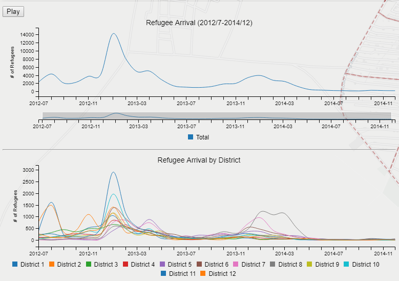

# Timeseries Chart Tutorial

> Spring 2019 | Geography 4/572 | Geovisual Analytics
>
> **Instructor:** Bo Zhao  **Location:** Wilkinson 210 | **Time:** TR 1600 - 1650 |
> **Tutorial by:** Benjamin Antolin

**Learning Objectives**

- Learn how to format data to effectively
- Learn how to add a dynamic timeseries chart on a leaflet map
- Learn how to filter map features through a time variable

#### JavaScript Libraries
### c3.js
This tutorial will use `c3.js` which is a javascript library that allows you to develop graphs and chart with faily simple syntax. The `c3.js` library is built using the `d3.js` javascript library and is a powerful tool to develop dynamic charts on a website while also having a relativley simple framework to work with.

### Leaflet

This tutorial will also use the `leaflet` javascript library to render a map and add map interaction with the `c3.js` library.

##### Other Libraries used:
- jQuery
- Google Fonts
- d3.js

### Introduction
This tutorial will use data collected from a survey conducted by [REACH](http://www.reachresourcecentre.info/advanced-search?name_list%5B%5D=JO&field_document_type_tid%5B%5D=6) in the Syrian refugee camp of Zaatari in Jordan. This data contains each individuals date of arrival which makes this dataset a good candidate to be visualized as a timeseries graph.

##### Data
Take a look at the [time.csv](assets/time.csv) file and take note of how the data is formatted. This data has been processed from the raw [survey data](assets/campdata/campdata.csv) of the Zaatari camp to reflect the influx of refugees arriving every month from July 2012 through December 2014. 
